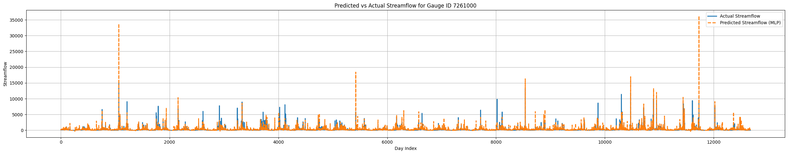

# **Applying Machine Learning to Flood Forecasting in Central Vietnam**

  

---

## **Abstract**

Aiming to reduce the devastating impacts of seasonal floods in central Vietnam, our team developed a data-driven forecasting system that leverages machine learning to predict river flows in ungauged basins. Because national streamflow datasets are scarce and often incomplete, the project turned to the U.S. CAMELS dataset, selecting gauge stations whose climatic and catchment characteristics resemble those in Vietnam. After preprocessing and normalizing more than 110,000 samples of precipitation, temperature, humidity, solar radiation, day length, terrain, and other hydrological features, the team trained a multilayer perceptron (MLP) model to map inputs to streamflow rates. The model was designed to capture the nonlinear relationships between inputs and outputs and optimized via gradient descent; robust scaling mitigated seasonal noise in the data. Validation experiments showed that the MLP generalizes well from the CAMELS training set to the Long Dai River in Quang Binh province, achieving high accuracy and effectively learning flow patterns despite the absence of local streamflow measurements. The system has been deployed as a web-based application that provides real-time flood forecasts for Long Dai, offering an early warning tool for communities in at-risk areas. Future improvements include incorporating satellite imagery, soil moisture, and water-level data to enhance predictive performance, expanding coverage to additional river basins, and integrating SMS or app-based alerts so residents can receive timely warnings. The project demonstrates that combining international hydrological datasets with machine learning and web technologies can yield practical flood-forecasting tools for data-limited regions.

---

## **Program: Summer in Engineering and Applied Sciences (SEAS)**

**Participant (selected 43 out of 400 applicants nationwide)**  

• Completed an intensive **two-week full-day program** on *Artificial Intelligence and Applications* (adapted from the **MIT Computer Science undergraduate curriculum**).  
• Collaborated on a **group project** applying machine learning to flood forecasting in Central Vietnam and presented project findings to mentors and peers at the conclusion of the program.  
• Worked directly with mentors from **Harvard**, **MIT**, **CERN**, **Stony Brook University**, **Ericsson Research**, **UIUC**, **UC Irvine**, **VinAI**, and other leading institutions.  

---

## **Dataset**

🌊 **CAMELS (Catchment Attributes and Meteorology for Large-Sample Studies)**  

The project utilized the **U.S. CAMELS dataset**, a large-scale hydrological dataset containing multi-year records of streamflow, meteorological forcings, and catchment attributes for over 600 basins across the continental United States.  
This dataset enables the development of machine learning models capable of **learning hydrological behavior** from diverse environments, allowing transferability to **ungauged or data-scarce basins** like those in Central Vietnam.  

📘 More about CAMELS:  
<https://ral.ucar.edu/solutions/products/camels>

---
## **Contributors**

**Minh-hau Tran** (Project Leader)  
**Duy-Hoang Nguyen**  

